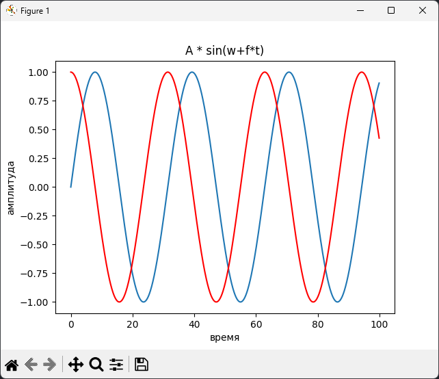

## Выполнить задание 

№1 Форматированный вывод данных

1. Вывести на экран 20 копий предложения “Hello World!” при помощи команды **print()**.
2. При помощи команды input() ввести с клавиатуры целочисленное число, возвести его во 2 степень и вывести результат на экран.

№2 Массивы 

1. Сгенерировать массив случайных чисел размером 1024 в пределах [-1000:1000].
2. Отсортировать данный массив.
3. Удалить все отрицательные числа.

№4 Изучение Matplotlib

1. Сгенерировать массив значений по синусоидальному закону, размер массива должен быть больше 1000, частоту, начальную фазу и амплитуду задать фиксированными значениями;
2. Вывести значения массива на графике;
3. Подписать оси графика (амплитуда, время);
4. Подписать сам график - “A * sin(w*f*t)”;
5. Добавить в этот же график аналогичный график, но с косинусом;

# Выполнение 

### №1
Легкий код в 5 строчек
  

### №2
Задание выполнено в двух вариантах:

[**2.py**](./files/2.py) выполнено с помощью массива библиотеки NumPy

[**2_1.py**](./files/2_1.py) выполнено с помощью стандартного списка языка Python

    
### №4 

