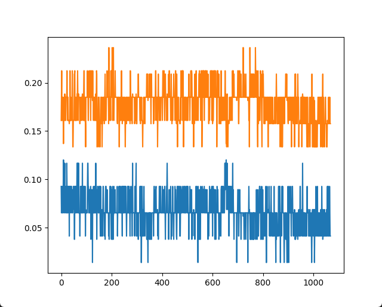

# Задание на практику 

# Задание
1 Посмотреть на корреляцию кода Баркера
2 Запустить сигнал из лекции, передать его и получить. Сохранить полученный сигнал


# Выполнение
### Задание 1
#### Код Баркера из 5
```py 
x = np.array([+1, +1, +1, -1, +1]) # код Баркера из 5
y = np.correlate(a,a,'full') # подсчёт корреляции
```  
 

#### Код Баркера из 11
```py
x = np.array([+1, +1, +1, -1, -1, -1, +1, -1, -1, +1, -1]) # код Баркера из 11
y = np.correlate(a,a,'full') # подсчёт корреляции
```
 

### Задание 2

Переданный сигнал   
 

```py
np.save('1.csv', xrec) # Сохранение сигнала в файл
```
```py
c = np.load("1.csv.npy")
plt.plot(c) # показ что в файле
```


 

что-то мне подсказывает что это шум((