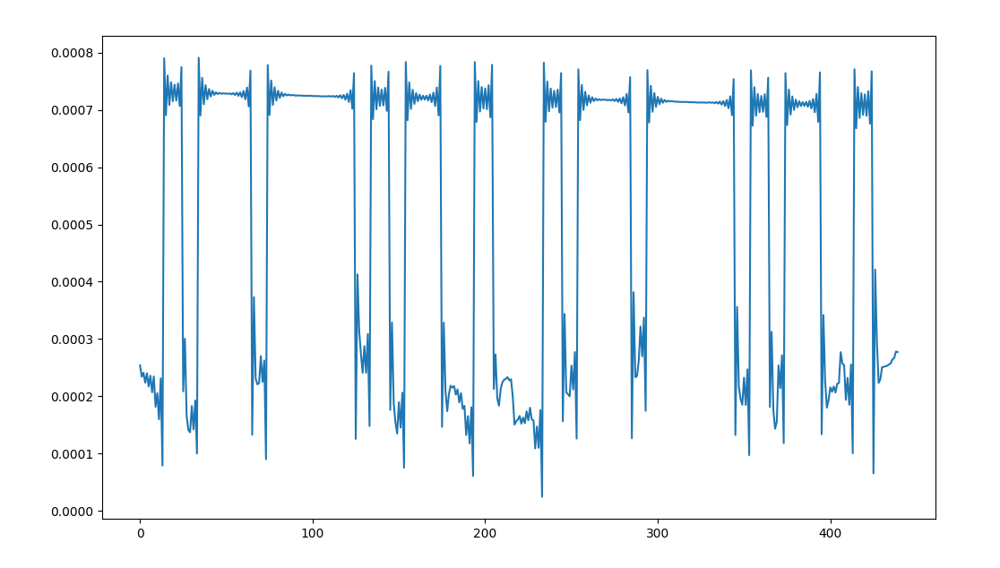
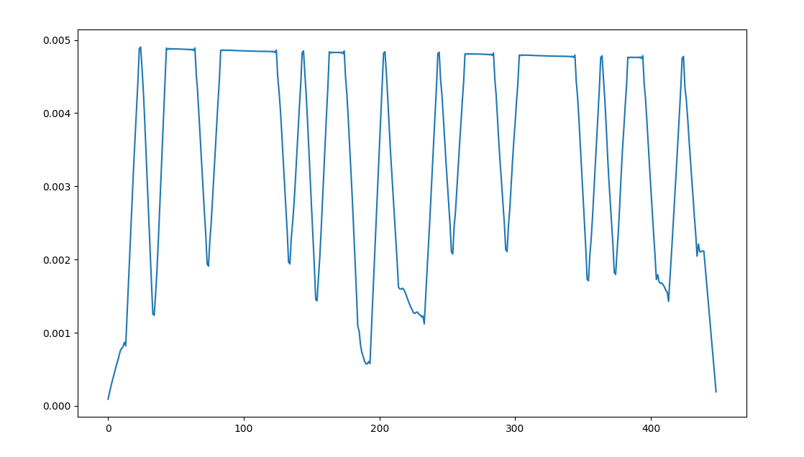
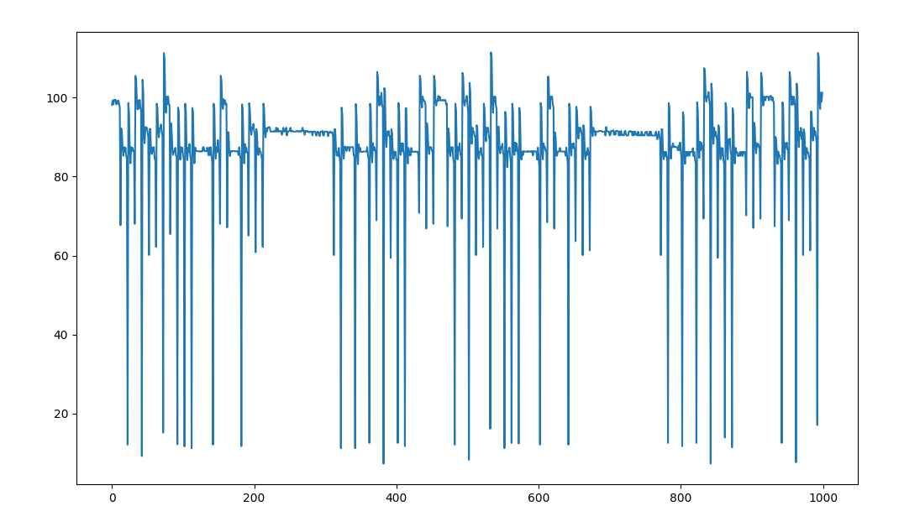
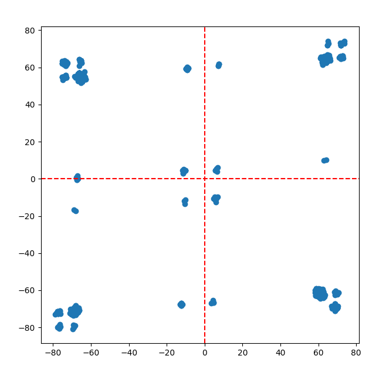
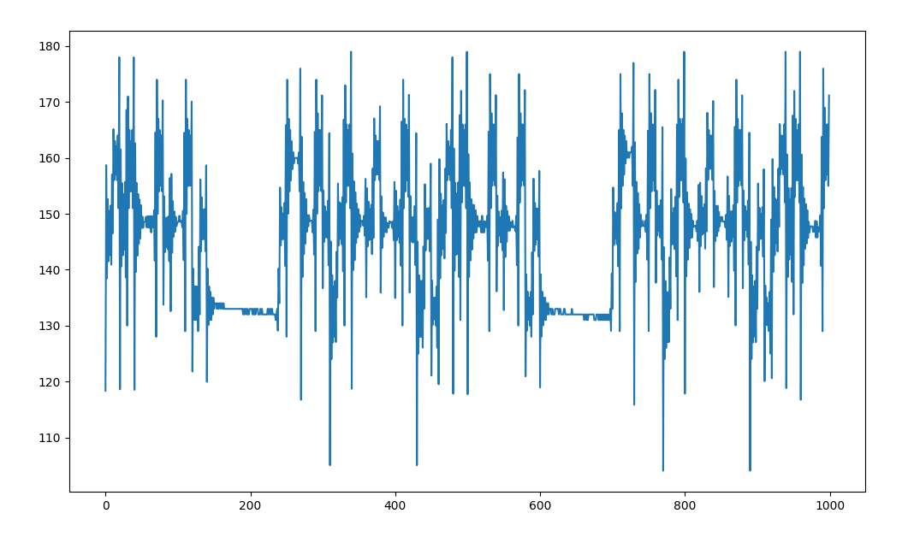
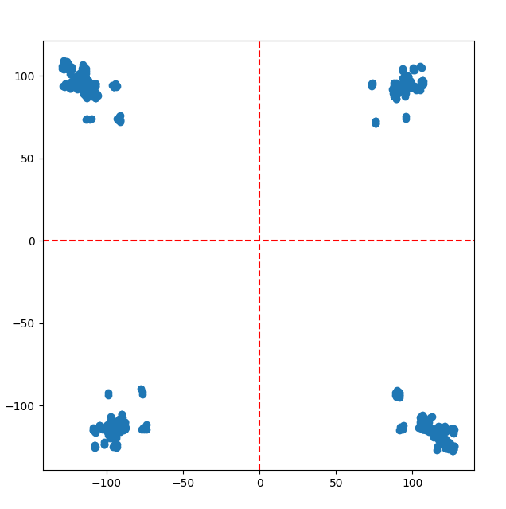
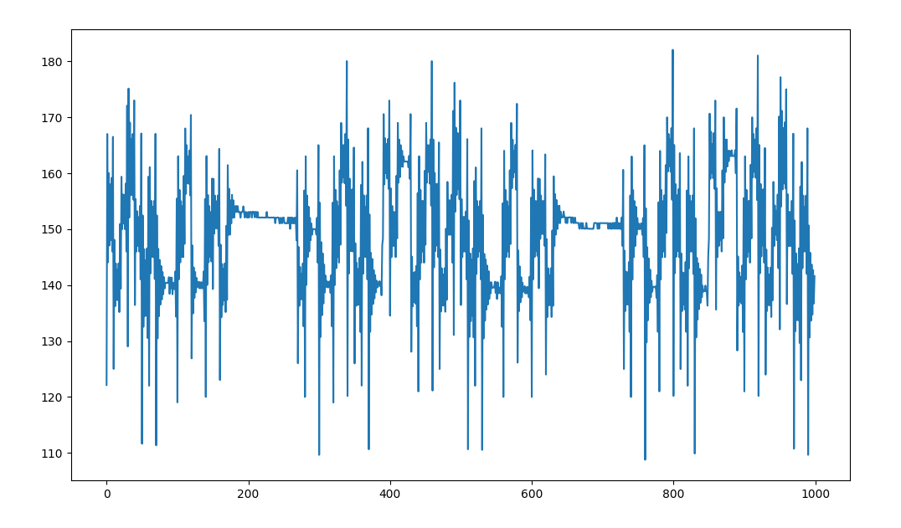
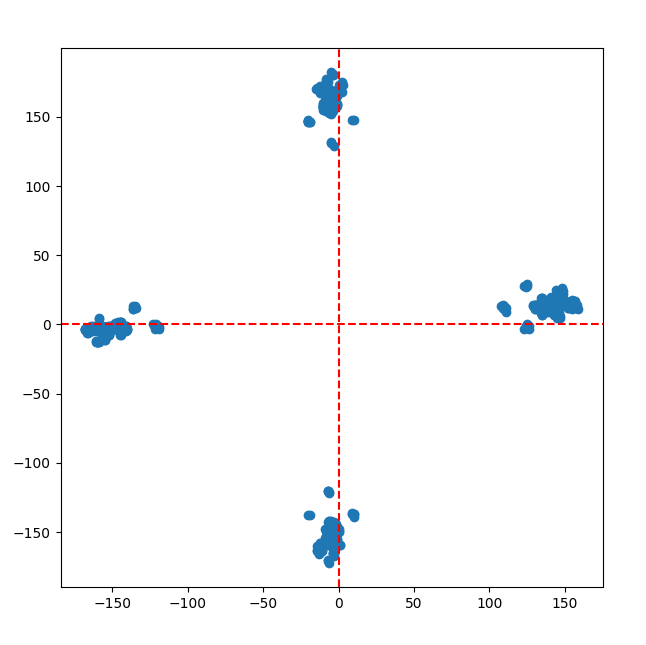
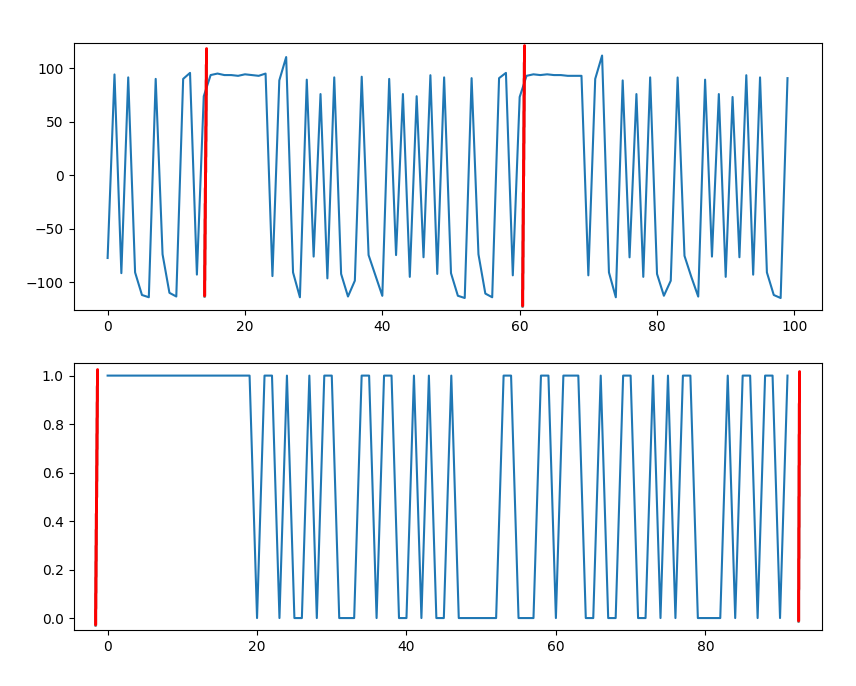

# Задание на практику 

# Задание
1. Передать и получить АМ сигнал  
2. Передать и получить QPSK модулированный сигнал


# Выполнение
### Задание 1
Сырой сигнал RX

 

```py
xrec = xrec1/np.mean(xrec1**2)
xrec_a = np.abs(np.real(xrec)) #вычисление модуля принимаемого сигнала
yf = np.convolve(xrec_a ,b)
np.abs(yf)
```
 


### Задание 2
Использовал свою библиотеку для SDR (версии 0.0.6)

Первая попытка  

       

Изменил несущую частоту + разворот на нужный угол  

     

Без функции для разворота сигнала по синхронизации   

     


### Выполнено дома
Используя свой файл `my_qpsk_rx2.npy` с сырым полученным сигналом rx,    
я отбросил все лишние символы и оставил чистый сигнал

```py
symbol_length = 10
symbols = samples.reshape(-1, symbol_length)
extracted_symbols = symbols[:, 0]
```

 

На нижнем графике исходный массив который передавался(90 бит)   
На верхнем обработанный сигнал rx в котором остались одиночные символы(45 символов)
