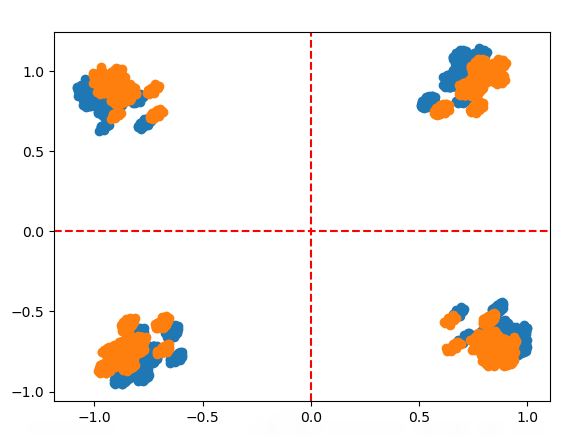
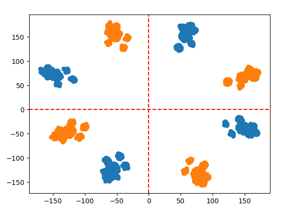
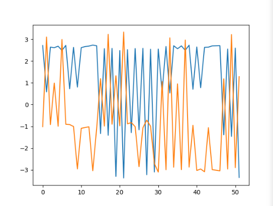
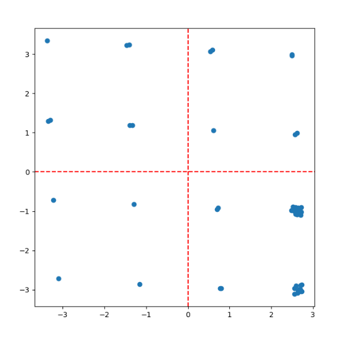
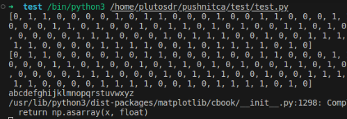

# Задание на практику 

# Задание
1. Реализовать грубую (первоначальную) коррекцию частотного смещения  

2. ***Моё задание***


# Выполнение
### Задание 1

```py
rx_4 = rx ** 4                          # умножаем сигнал на 4, тк это qpsk
fur = np.fft.fft(rx_4)                  # высчитываем ДПФ
fur = np.fft.fftshift(fur)              # смещаем ДПФ от -π до π
argmax = np.argmax(fur)                 # поиск частоты на которую смещён сигнал
w = np.linspace(-np.pi, np.pi, len(rx))   # обьявляем список от -π до π, такойже длинны как и rx
fi = w[argmax] / 4                      # находим угол на который нужно сместить в радианах 
rx = rx * np.exp(-1j * fi)              # уможаем сигнала на экспоненту
```


     
     

*(синий - оригинал, оранжевый - повернутый)*

Что видно по скриншотам?! Правильно, сигнал разворачивается на абсолютно случайный угол)

### Моё задание
Я реализовал QAM16 модуляцию, переда его, получил и декодировал     
Использовал свою библиотеку(ссылка в главном README)




   

*всё правильно передалось и декодировалось*