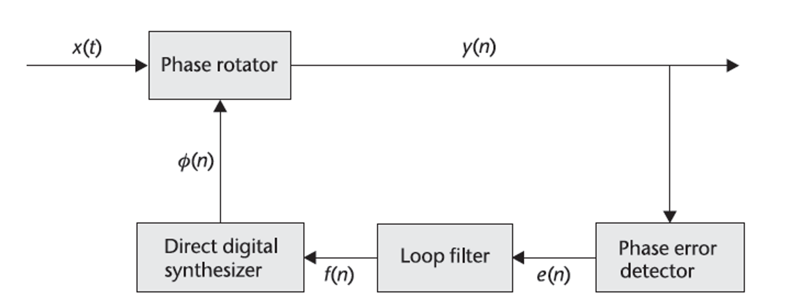
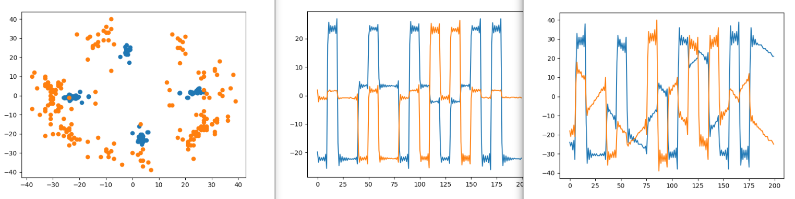

# Задание на практику 

# Задание
1. Попытка реализовать PLL 


# Выполнение
### Задание 1



```python
iter = 2000  # Число попыток найти Δφ
exp_fine = np.zeros(iter)  # Массив длиной в iter итераций
exp_fine[0] = 1
fi_e = np.zeros(iter)
a1 = 0.1  # Коэффициент фильтра
kc = 0.03  # Коэффициент интегратора
integrator_out = 0
fi_n = 0  # Первоначальная оценка сдвига фазы

for n in range(iter):
    exp_fine[n] = np.exp(1j * fi_n)
    fi_e[n] = np.angle(rx * exp_fine[n]) * a1
    integrator_out += fi_e[n] * kc
    fi_n += integrator_out  # Обновление оценки фазы с учетом выхода интегратора
    
rx = rx * np.exp(-1j * fi)
```



Не получилось