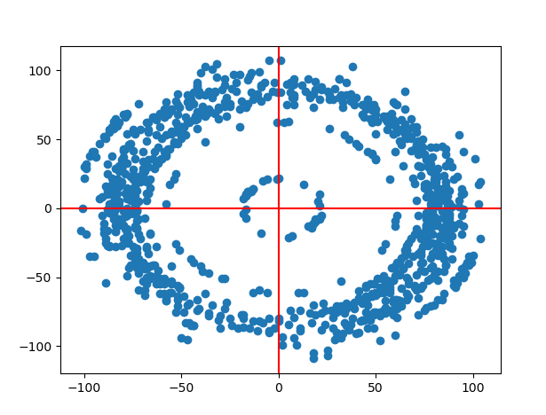
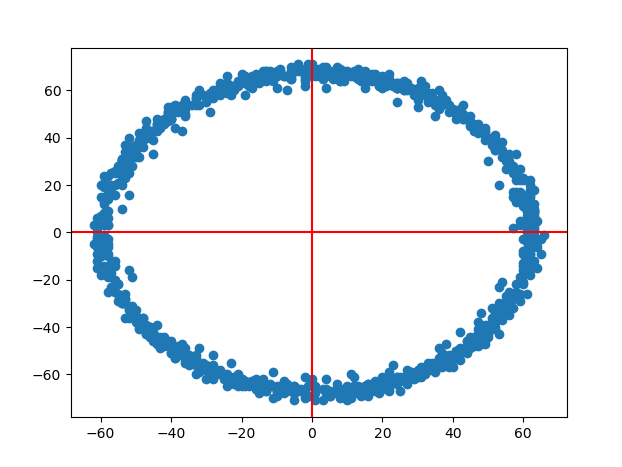
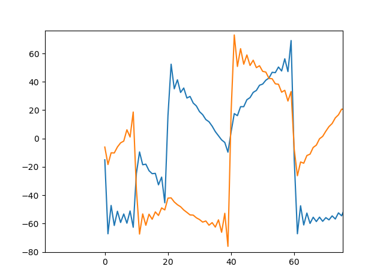

# Задание на практику 

# Задание
1. Посмотреть реализованную PLL


# Выполнение
### Задание 1
```python
for i in range(iter-1):
    s_loop[i]=np.exp(1j*phi1[i])
    dds_mult[i]=rx2[i]*np.conjugate(s_loop[i])
    #dds_mult[i]=xrec[i]*np.conjugate(s_loop[i])# 
    phi_error[i]=np.imag(dds_mult[i]) # фазовая ошибка 
    #phi_error[i]=np.imag(xrec[i])*np.real(s_loop[i])-np.real(xrec[i])*np.imag(s_loop[i])
    #phi_error[i]=np.angle(dds_mult[i])
    prop_out = phi_error[i]*Kp
    int_out = phi_error[i]*Ki+int_out
    phi_error_filtered[i]=prop_out+int_out
    phi1[i+1]=phi1[i]+phi_error_filtered[i]

xrecc=rx2*s_loop
```

Графики полученного qpsk сигнала между двумя sdr    



Временной график, на котором видно как смещается сигнал     
     