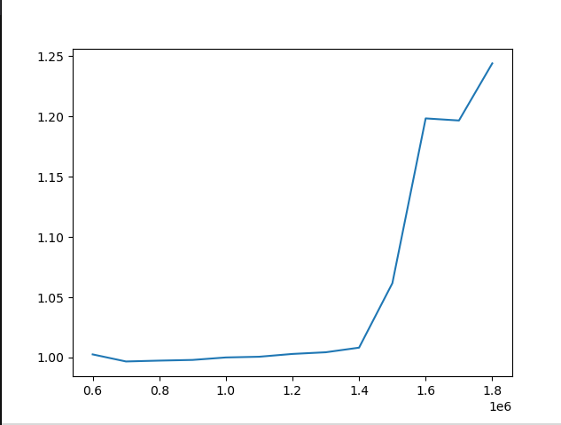
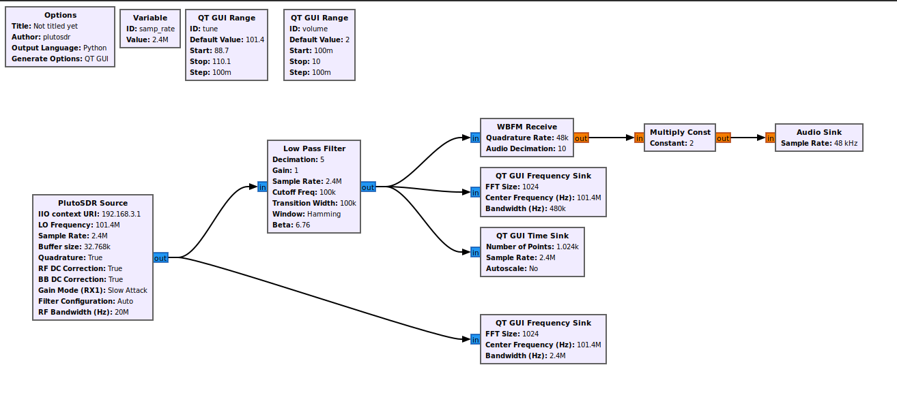
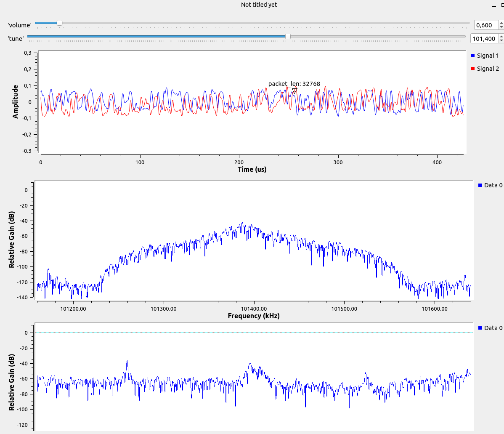

# Задание на практику 

# Задание
1. Посмотреть сколько сэмплов передаётся через USB2.0 
2. Хакнуть SDR(поставить программно AD9364)
3. Реализовать радио приёмник в GNU Radio

# Выполнение
### Задание 1

[Ограничение скорости usb2.0](https://humble-ballcap-e09.notion.site/usb2-0-4edafac7061a4869abefd5564d986522)  
Код из моего доклада

Нужно было добавить цикл который менял **sample rate** и вывести график     

Видно что за секунду без потерь может передаваться примерно 1.2 Мега сэмплов

### Задание 2

[Как "хакнуть" PlutoSDR](https://humble-ballcap-e09.notion.site/nicoskin/PlutoSDR-6e3f0880417f4927895cffa93ca2cf50)     

Выполнил инструкцию из моего доклада

### Задание 3

     

Сконфигурировал с помощью блоков вот программу, добавил дополнительный ползунок громкости       

### 

Первый график временной     
Второй частотный выбраной радиостанции      
Третий частотный видно разные радиостанции      
