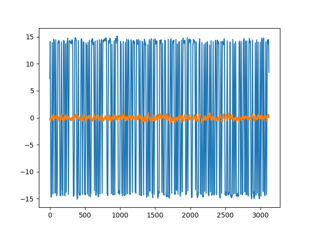
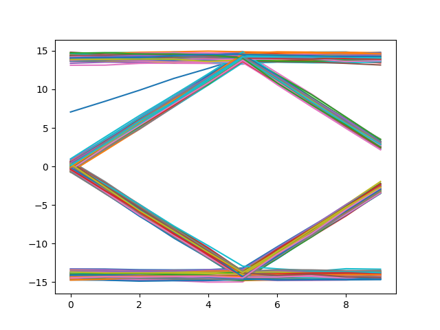
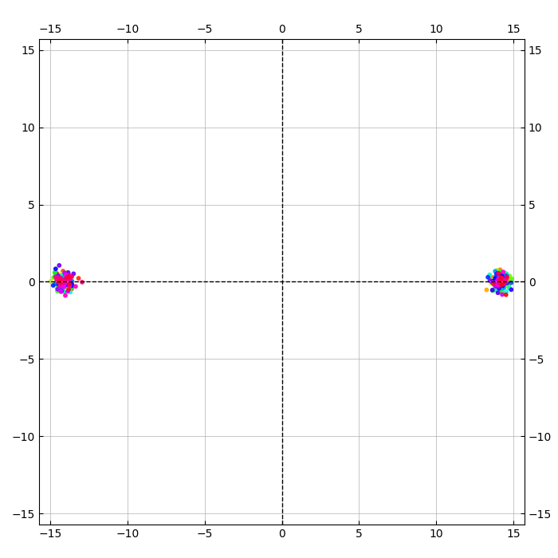

# Задание на практику 

# Задание
1. Вывети глазковую диаграмму
2. Оставить от сигнала только отдельные символы

# Выполнение
### Задание 1

Сгенерировал bpsk сигнал с небольшим шумом       

     

Отобразил по 10 элементов на графике для глазковой диаграммы  

### Задание 2

Из глазковой диаграммы сохранил только 5ые элементы    

