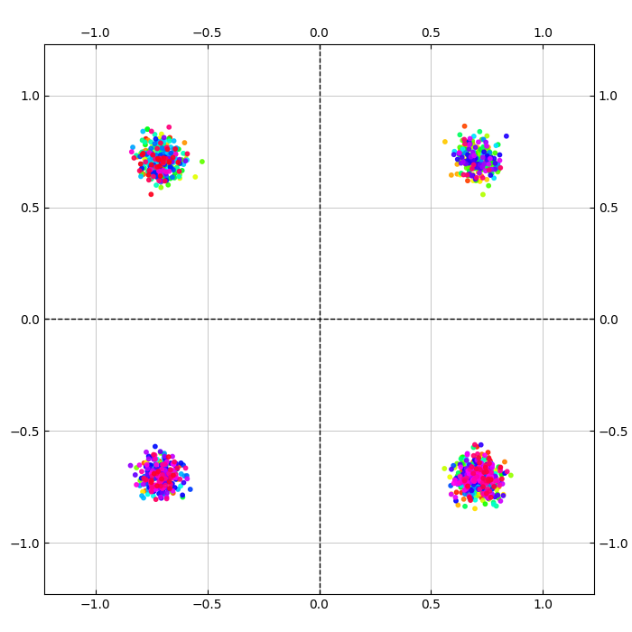

# Задание на практику 

# Задание
1. Вывети глазковую диаграмму
2. Посмотреть как меняется глазковая диаграмма в зависимости от смещения начала символа

# Выполнение
### Задание 1

Сгенерировал qpsk сигнал с небольшим шумом       

     

Не искажённый график

График после свёртки

### Задание 2

Глазкова диаграмма при 0 смещении  

Глазкова диаграмма при смещении на 5 сэмплов(половину символа)

Глазкова диаграмма при смещении на 2 сэмплов

