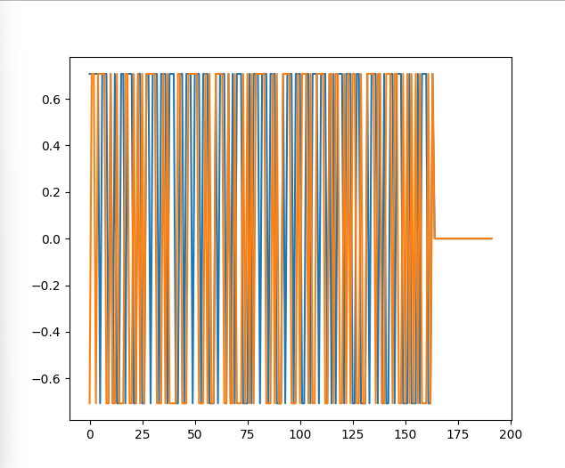
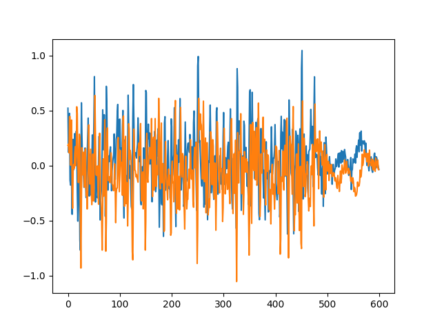
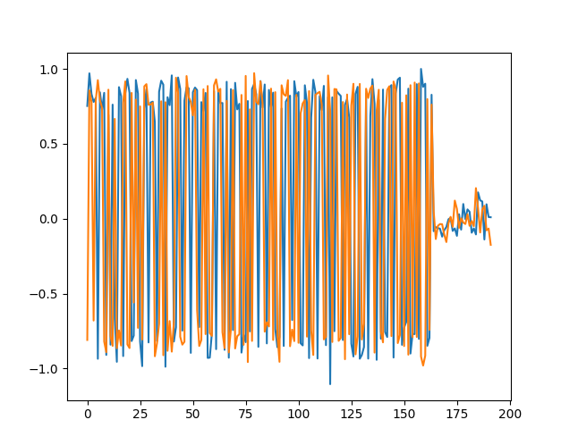
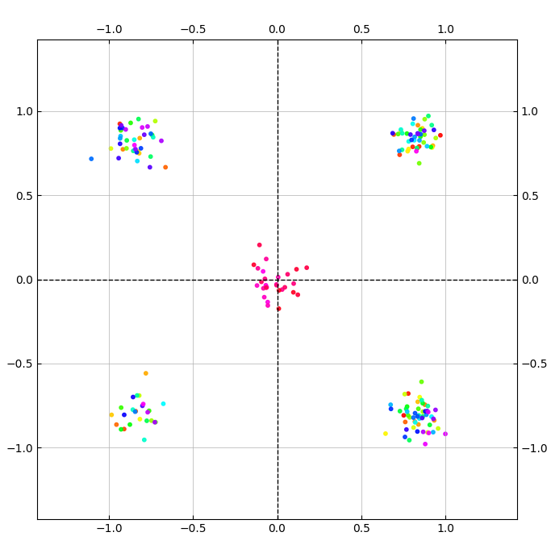

# Задание на практику 

# Задание
1. Создать OFDM сигнал и получить его

# Выполнение
### Задание 1

Искодный QPSK сигнал  

     

Сформировнные сигнал с помощью IFFT (+ шум)

     

Полченный QPSK сигнал после преобразования FFT из OFDM

    

 