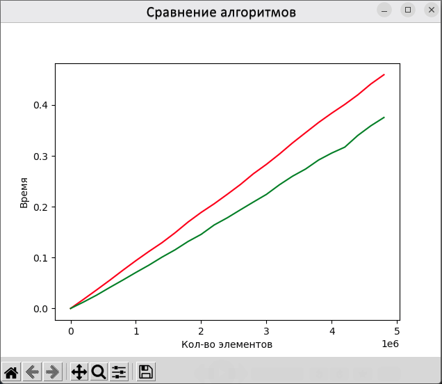
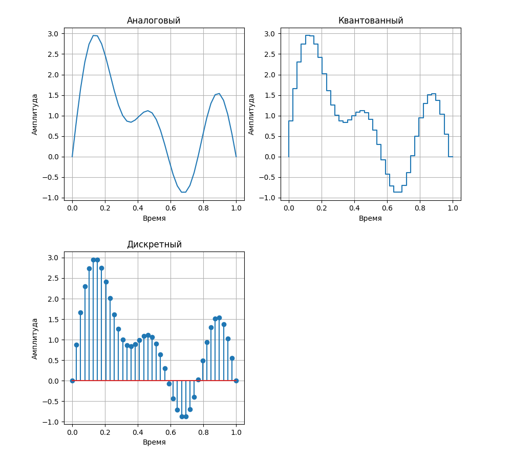
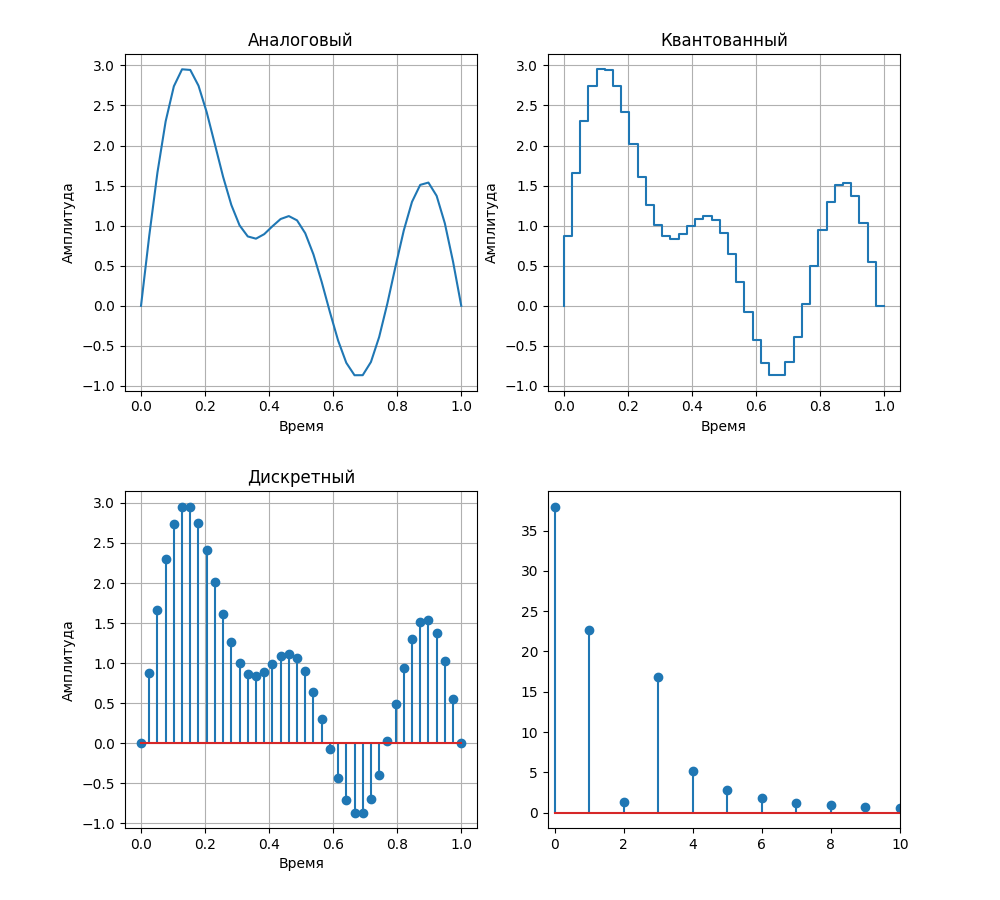

# Задание на практику 

Задание №1 Сравнение скорости работы **lists** и **NumPy**

1. Сравнить время выполнении функции сортировки для **Python Lists** и **NumPy**
2. Вывести на графике зависимость времени выполнения операции сортировки (ось Y) от количества элементов (ось X). Количество элементов считать от 10 до 5000000 c шагом примерно от 100000 до 300000. 
3. Подписать на графике название осей.
4. Загрузить результат исследования на Github

Задание №2 Создание графиков с различным стилем отображения

1. Изучить базовые функции библиотеки matplotlib
2. Создать 2 дополнительных графика со стилями:
    1. В виде отсчетов (используя функцию `stem`)
    2. В виде квантованных уровней (функция `step`)
3. Дать название каждому графику:
    1. “Аналоговый”
    2. “Дискретных”
    3. “Квантованный”
4. Добавить к фону графика “сетку” масштаба (`grid`)
5. Подписать название осей.
6. Объединить 3 графика в одной картинке (`fig`)
7. Загрузить результат на GitHub

# Выполнение
### №1
посчитал время сортировки случайного массива для **Python Lists** и **NumPy**  
от 10 до 5000000, с шагом 200000(для уменьшения времени ожидания расчётов)

### №2

  

### №3
Третье задание было дополнительным, заключалось в том чтобы попробовать добавить 4ый график fft  

