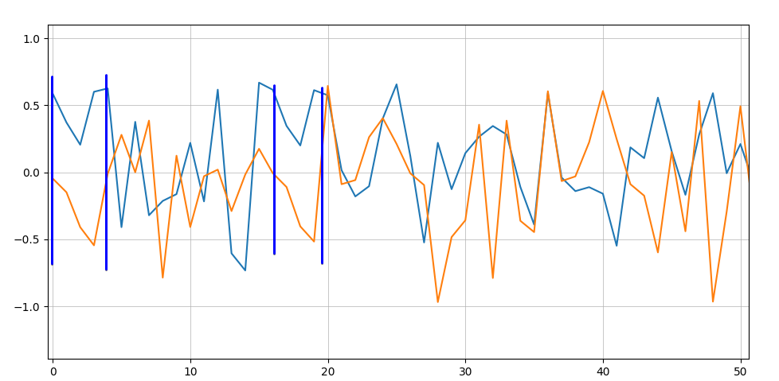
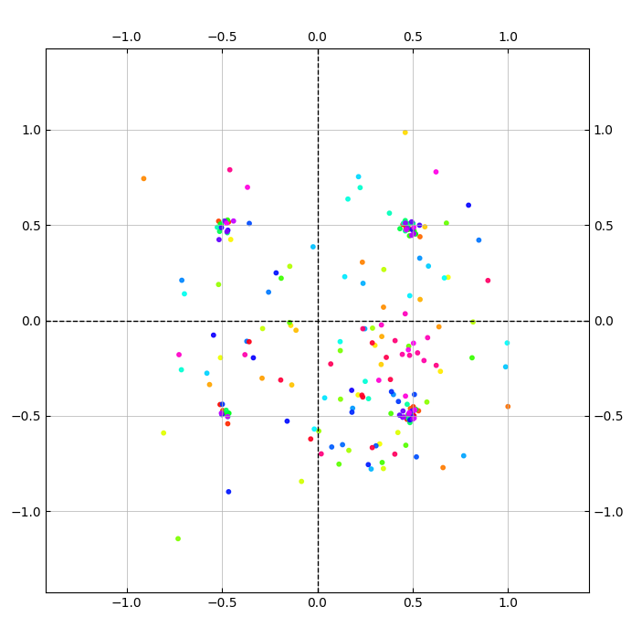

# Задание на практику 

# Задание
1. Создать OFDM сигнал, добавив к нему циклический префикс

# Выполнение
### Задание 1

Сформированный OFDM символ с циклическим префиксом

     

Что получилось после применение на все данные FFT

   

тк не выполнена символьная синхронизация 