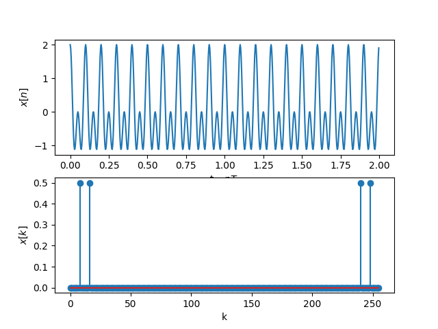

# Задание на практику 

1. Для заданных значений частоты синала и частоты дискретизации получите дискретное колебание, отсчеты посмотрите в *Variable Explorer*. Далее увеличьте частоту сигнала в несколько раз, при этом так же увеличится и частота дискретизации, но отношение частоты сигнала и частоты дискретизации - **нормированная частота** останется той же величиной. Сравните дискретные отсчеты первого и второго сигналов.
2. Вычислите шаг частот между точками ДПФ `∆f=fs/N`. Определите, в какой точке ДПФ находится заданный сигнал.
3. Измените частоту сигнала в целое чисто раз, определите номер точки ДПФ для данного сигнала.
4. Измените количество точек ДПФ до *512*. Вычислите шаг частот между точками ДПФ `∆f=fs/N`. Определите, в какой точке ДПФ находится заданный сигнал.
5. Задайте сигнал в виде суммы двух колебаний. Вычислите ДПФ сигнала.
6. Вычислите ОДПФ сигнала, заданого в частотной области в виде **X=np.array([0,0,1,0,0,0,0,0])** Задавайте ненулевое значение в различных разрядах. Также задайте значение в комплексной форме **X=np.array([0,0,1j,0,0,0,0,0])**, поменяйте знак мнимой единицы, задайте спектр ДПФ в виде **X=np.array([0,0,2-1j,0,0,0,0,0])** поменяйте знак мнимой единицы. Можно увеличить количество точек до 16 при одном ненулевом значении.

*Доп задание:
используя код задания прошлой недели построить граффик fft*

# Выполнение

### №1


По графикам видно что нормированная частота одинаковая

### №2
`∆f=fs/N`
320/256 = 1.25

При fc = 10   
*k=8*


### №3
При fc = 20 и закреплённым fs = 320     
*k=16*

### №4
`∆f=fs/N` 320/512 = 0.625   
При fc = 10, N = 512     
*k=16*

### №5
```
x=np.cos(2*np.pi*fc*t)+np.cos(2*np.pi*20*t)
```



### №6
Для увеличения наглядности добавил график cos с частотой 2Hz    
`x=np.cos(2*np.pi*t*2)`     

[0,1,0,0,0,0,0,0]   
    
[0,0,0,1,0,0,0,0]    
  
[0,0,0,0,0,1,0,0]   
    
[0,0,1,0,0,0,0,0]   
     
**Вывод**   
*Единица на различных разрядах это частота колебания*       

[0,0,1j,0,0,0,0,0]      
    
[0,0,-1j,0,0,0,0,0]         
   
**Вывод**   
*Мнимая единица влияет на фазу колебания*   

[0,0,2-1j,0,0,0,0,0]      
      
**Вывод**       
*Число перед мнимой единицей влияет на амплитуда колебания*     


### № Доп задание
Дописал к коду недельной давности:
```
N=1024 # количество точек ДПФ
X = fft(rx,N)/N
plt.figure("FFT")
plt.stem(abs(X))
```
   
   

`sdr.rx()` возвращает *1024* значения       
это малая часть от того сколько частота дискретизации   
чтобы `fft` в моём случает давала реальный рисунок частот, нужно поменять настройки Adalm-pluto чтобы частота дискретизации была *1024*
