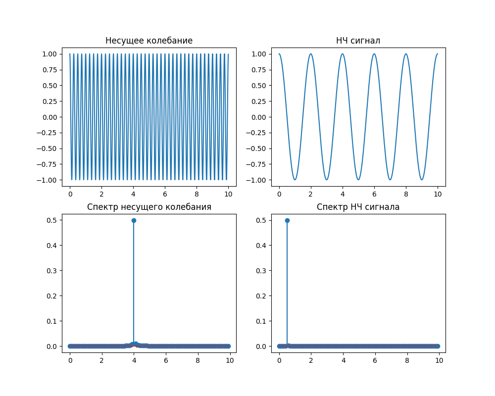
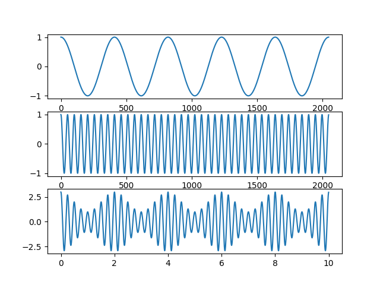
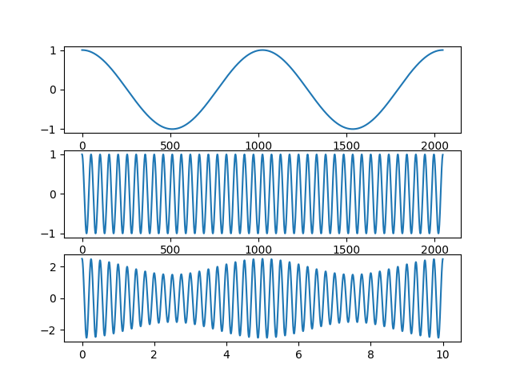
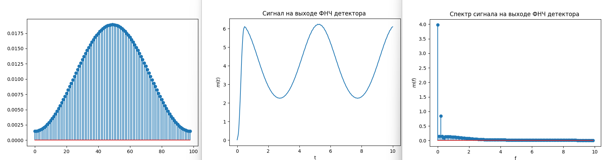
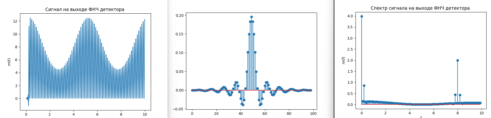
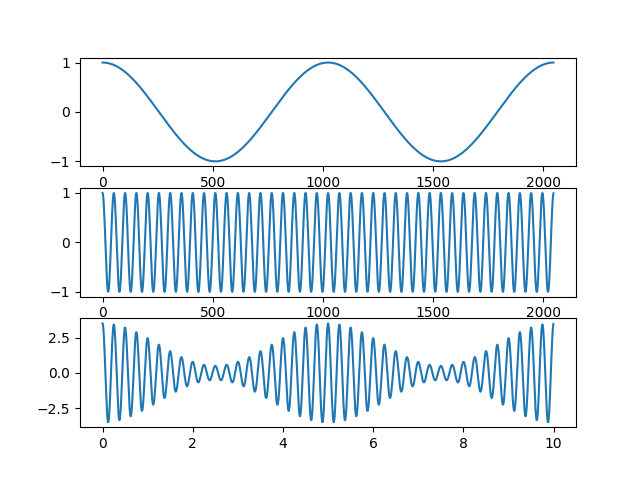
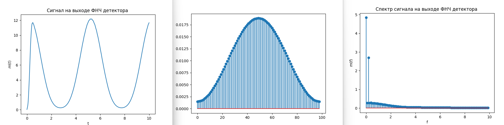
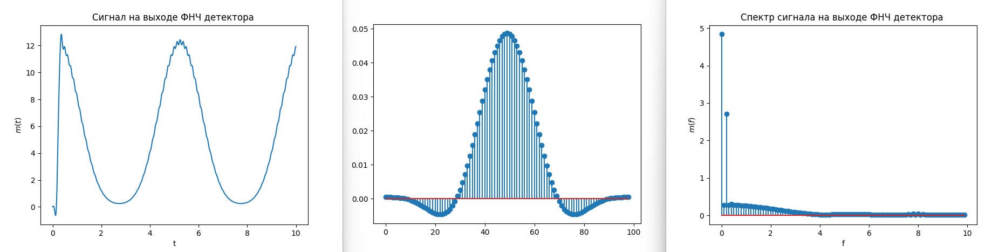

# Задание на практику 

# Задания лекции

1. Для заданных значений параметров несущего колебания и НЧ сигнала определите значение частоты дискретизации (в менеджере переменных), значение индекса АМ. Получите временную и спектральную диаграммы несущего колебания и НЧ сигнала.
2. Получите сигнал АМ с параметрами fc = 4, fm = 0.2, Ac = 2 , Am = 0.5. Получите временную и спектральную диаграммы несущего колебания и НЧ сигнала. Определите нормированную частоту среза ФНЧ fn в менеджере переменных. Попробуйте изменить ее значение (задайте в программе fn) и сравните качество дететирования.
3. Получите сигнал АМ с параметрами fc = 2, fm = 0.2, Ac = 2 , Am = 1.5. Получите временную и спектральную диаграммы несущего колебания и НЧ сигнала. Определите нормированную частоту среза ФНЧ fn в менеджере переменных. Попробуйте изменить ее значение (задайте в программе fn) и сравните качество дететирования.

# Задания практики

**Задание №1**

1. При помощи документации настройте приемник и передатчик на одну несущую частоту - **2.4** [GHz] + **2** [MHz] * “**номер стола**”;
2. Установить `.sample_rate = 1e6`;
3. По умолчанию, количество сэмплов, получаемых с буфера, равно **1024**.
4. Сгенерируйте простую синусоиду:
    1. Количество элементов вектора - на свое усмотрение;
    2. Макс. амплитуда может быть равна **2**14;**
5. Отправьте сгенерированные сэмплы синусоиды на функцию передатчика;
6. Отобразите на графике принятый сигнал и его спектр;
7. p.s. за регулировку мощности передатчика и чувствительностью приемника отвечают методы  `tx_hardwaregain_chan0` и `rx_hardwaregain_chan0` соответственно;

**Задание №2**

1. Установите размер **1 символа** - на свое усмотрение.
2. При помощи **ASCII** таблицы (кодировщика) закодируйте свои данные (ФИО) в виде битовой последовательности.
3. При помощи изменения максимальной амплитуды радиосигнала сформируйте синусоиду (из Задания №1) по правилам амплитудной модуляции. Уровни модуляции для `“0”` и `“1”` установите опытным путем.
4. Передайте ваши данные на `tx()` и “**примите + декодируйте**” на стороне `rx()`. 
5. Опишите с какими проблемами вы столкнулись во время выполнения задания и как их решили.

**Задание №3 (бонус)**

1. Примите + декодируйте данные от соседей.
2. Запишите полученный список соседей в файл.

# Выполнение
## Задания лекции
<details>

## №1
Частота дискретизации `fs` = *204.7*    

Значение индекса АМ `mu`=*0.5*




## №2
`fc = 4, fm = 0.2, Ac = 2 , Am = 0.5`    
   
    
Нормированная частота среза ФНЧ `fn` = *0.000977*    


      

Нормированную частоту среза ФНЧ умножил на 200 `fn*200` = *0.1954*  
ФНЧ не работает

## №3
`fc = 2, fm = 0.2, Ac = 2 , Am = 1.5`    
    




Нормированная частота среза ФНЧ `fn` = *0.000977*



Нормированную частоту среза ФНЧ умножил на 50 `fn*50` = *0.04885*   
ФНЧ работает, но не идеально

</details>

## Задания практики
<details>

### Задание №1

**1**
```py
frequency = 2400e6+(2e6*2)
sdr.rx_lo = int(frequency)
sdr.tx_lo = int(frequency)
```

**2**
```py
sdr.sample_rate = 1e6
```

**4**
```py
fc = 10000
ts = 1/float(1e6)
t = np.arange(0, fc*ts, ts)
i = np.sin(2*np.pi*t*fc) * 2**14
q = np.cos(2*np.pi*t*fc) * 2**14
samples = i + 1j*q
```

**5**
```py
sdr.tx_cyclic_buffer = True # Enable cyclic buffers
sdr.tx(samples)
```

**6**
```py
for r in range(30):
    rx = sdr.rx()
    plt.clf()
    plt.plot(rx.real)
    plt.ylim(-1000, 1000)
    plt.draw()
    plt.pause(0.05)
    time.sleep(0.0001)
``` 


### Задание №2

**1**   
```py
symbol=12
```
**2**   
` 112, 117, 115, 104, 110, 105, 116, 115, 97 - pushnitsa `  
в двоичном коде:    
`0, 1, 1, 1, 0, 0, 0, 0, 0, 1, 1, 1, 0, 1, 0, 1, 0, 1, 1, 1, 0, 0, 1, 1, 0, 1, 1, 0, 1, 0, 0, 0, 0, 1, 1, 0, 1, 1, 1, 0, 0, 1, 1, 0, 1, 0, 0, 1, 0, 1, 1, 1, 0, 1, 0, 0, 0, 1, 1, 1, 0, 0, 1, 1, 0, 1, 1, 0, 0, 0, 0, 1`  

**3**   
Сформировал сигнал 
```py
for i in range(len(binary_list)):
    if(binary_list[i]==0):
        for p in range(symbol):
            x.append(1)
    else:
        for p in range(symbol):
            x.append(6)
x1=np.array(x)
```
Сформировал синусоиду   
```py
t=np.linspace(0,len(x1),len(x1))
fc=80
q=np.sin(2*np.pi*t*fc)
```
Перемножил их
```py
sam = 2*(1.5*x1)*q
```


##### (4,5 пункты времяни выполнить не хватило) (перенесено на следующую практику)

</details>
