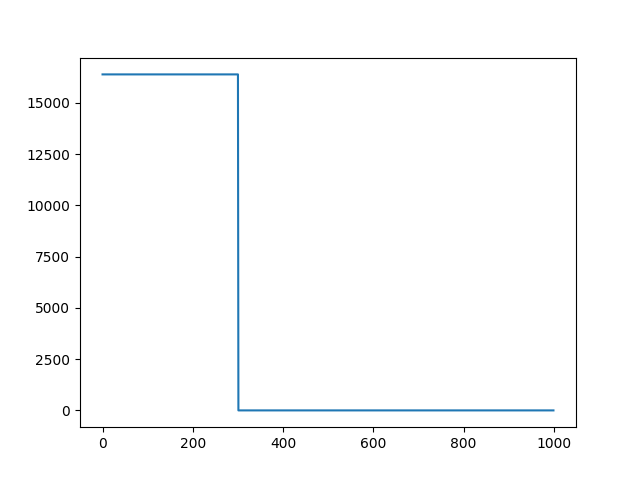
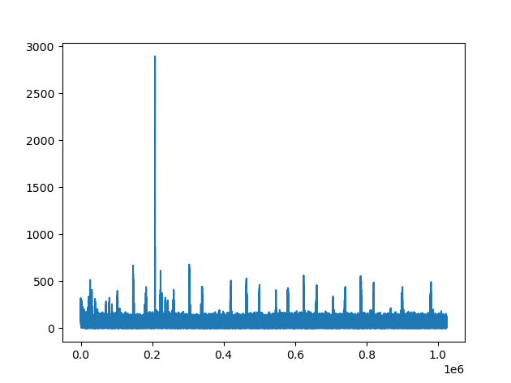
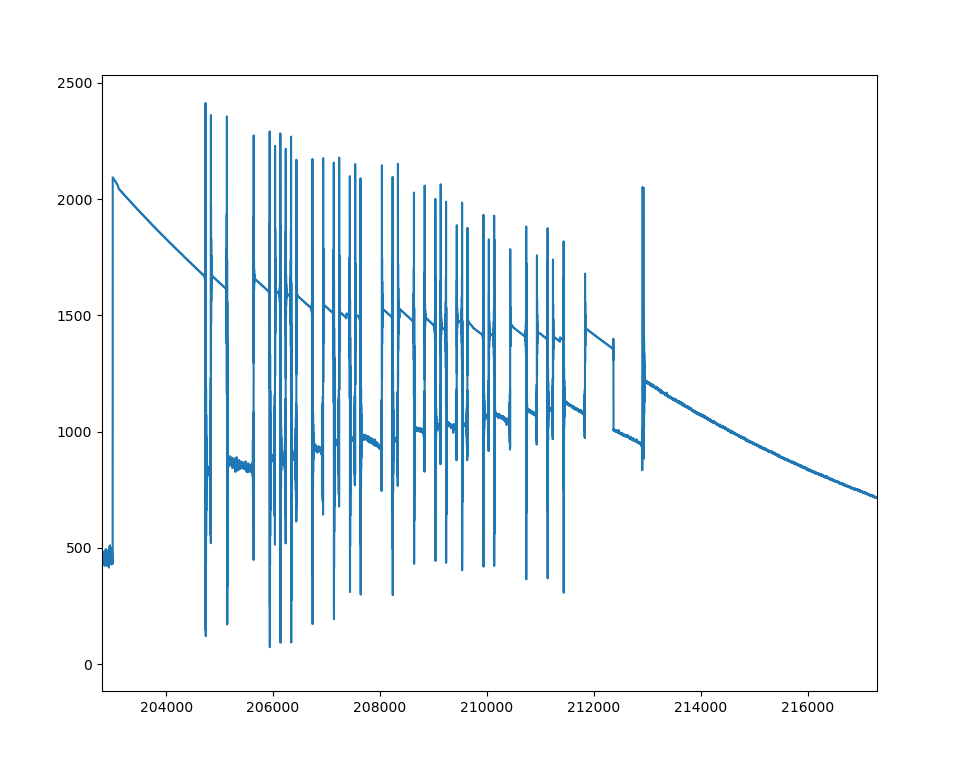

# Задание на практику 

# Задания

1.  a. Сгенерировать сигнал длинной *1000* сэмплов. *300* семплов = *1*, *700* = *0*  
    b. Передать этот сигнал и получить его, отобразить секунду получения сигнала

2.  Закодировать слово с помощью **ASCII** таблицы. Передать его, получить и расшифровать   
    - перед сигналом должы быть 16 бит - 1
    - в конце 10 бит - 1
    - symbol length = 100 samples


# Выполнение

### №1   

Функция cоздаёт массив - первые *300 samples* = 1, остальные = 0    
(2**14 это амплетуда)
```py
samples = np.zeros(1000, dtype=complex)
for i in range(1000):
    if (i <= 300):
        samples[i] = 1*2**14 + 1j*2**14 
```


####       
Функция получает массив ***samples*** и суммирует в массив ***rx*** все значения функции ***rx()*** за секунду
```py
def rx_sig(samples, tx_cycle: bool, start_tx: int): # Функция передает samples начиная с ±(start_tx * 1000 + 3000) семпла | Возвращает массив rx
    sdr.tx_cyclic_buffer = tx_cycle
    rx = []
    for i in range(1000): # Считывает секунду Rx
        if (i==start_tx): # На start_tx * 1000 сэмпле начать Tx
            sdr.tx(samples)
        new_data = sdr.rx()
        rx.extend(abs(new_data))
    return rx
```


Видно пик примерно на 0.2сек (это как раз мой пик в 300 семплов)
 
  

### №2  
Функция которая преобразует строчку в битовый массив с 16 единицами в начале и 10 в конце
```py
def create_bit_str(fio: str): # Функция преобразования строку в битовую последовательность | Возвращает bit_array
    encoded_bytes = fio.encode('ascii')
    # Преобразование байтов в массив битов
    bit_array = []
    for byte in encoded_bytes:
        bits = bin(byte)[2:].zfill(8)  # Преобразование в биты
        bit_array.extend([int(bit) for bit in bits])

    bit_start = np.ones(16) 
    bit_stop = np.ones(10)
    bit_array_list = list(bit_array)
    bit_array_list = list(bit_start) + bit_array_list + list(bit_stop) # Добавление стартовых 16 бит и конечных 10
    bit_array = np.array(bit_array_list)
    return bit_array
```
 Функция преобразования samples в прямоугольный сигнал в зависимости от bit_array
```py
def samples_from_bits(bit_array, symbol_length: int, amplitude_1: int, amplitude_0: int): 
    sample = np.zeros(len(bit_array)*(symbol_length+10), dtype=complex) # sample массив из длинны бит*110 комплексных нулей (не 100 чтобы потом немного пустого места было)
    for i in range(len(bit_array)):
        for o in range(symbol_length):
            if bit_array[i] == 1:
                sample[i * symbol_length + o] = 1*amplitude_1 + 1j*amplitude_1
            elif bit_array[i] == 0:
                sample[i * symbol_length + o] = 1*amplitude_0 + 1j*amplitude_0
    
    return sample
```
Передал слово `pushnitsa`   
Получил битовую последовательность(пока не раскодировано)

