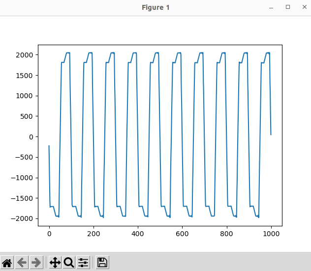
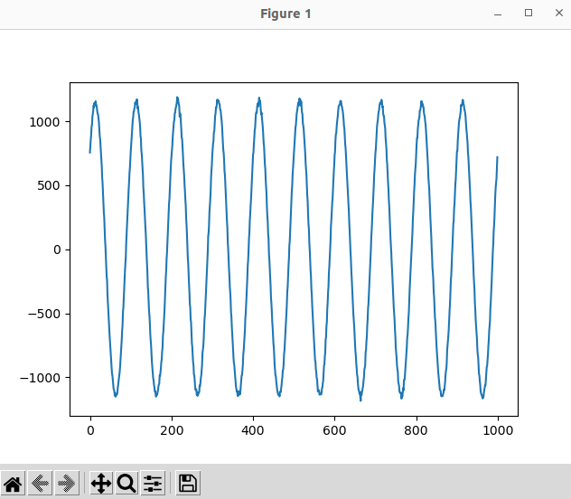
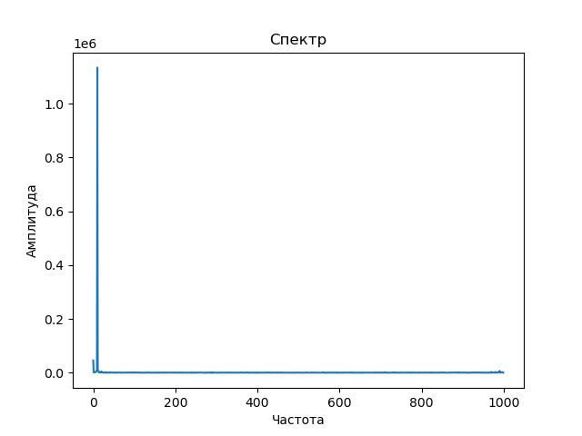
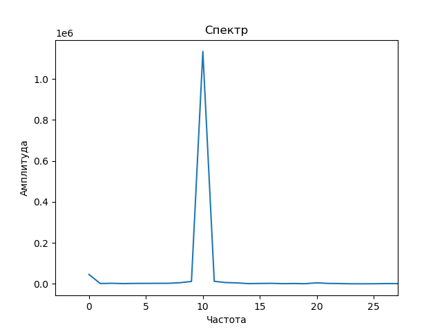
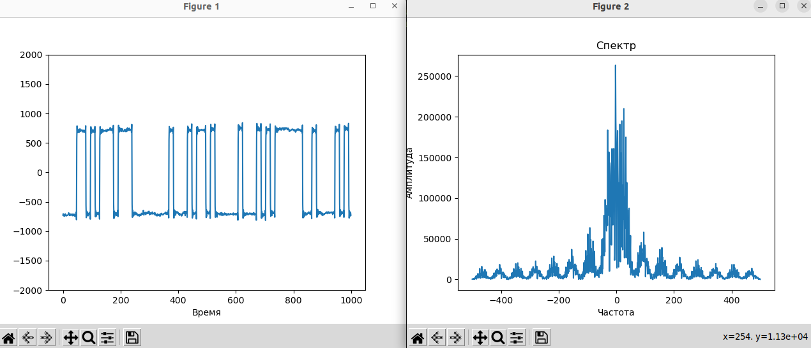
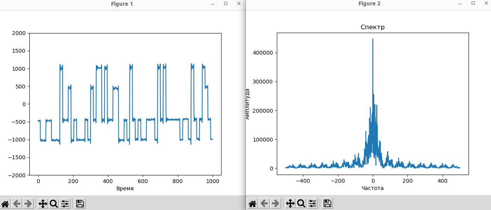
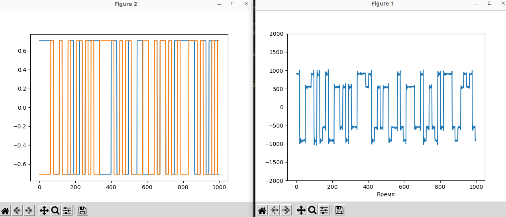
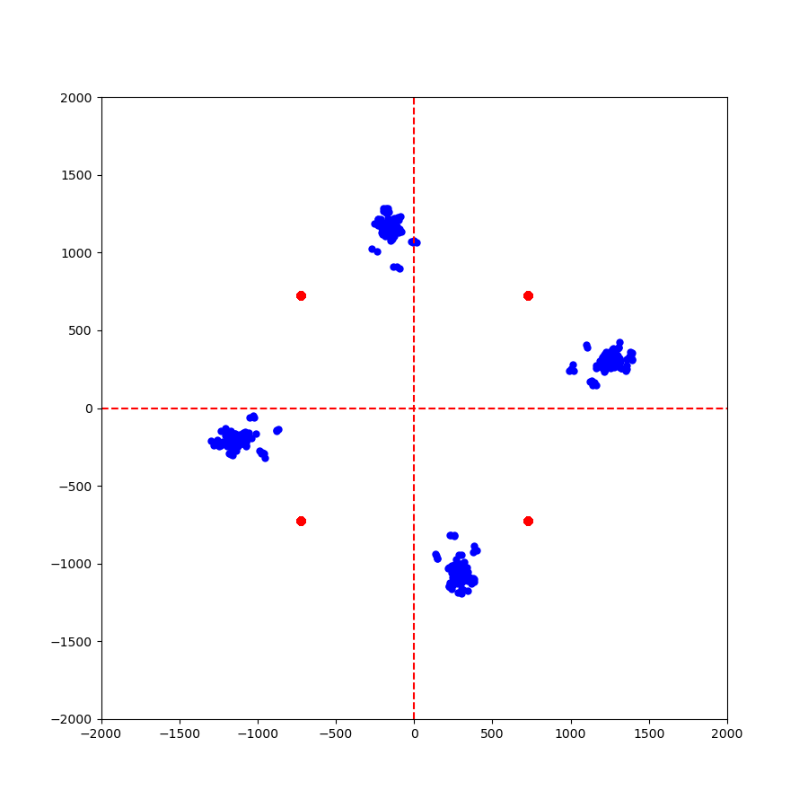
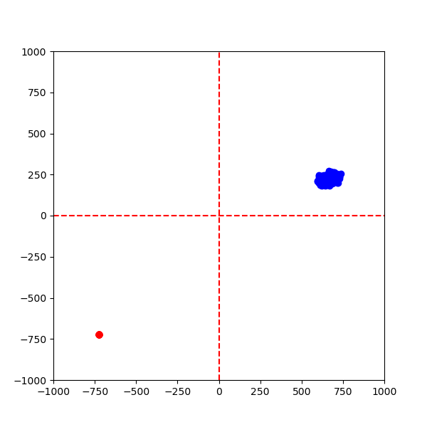
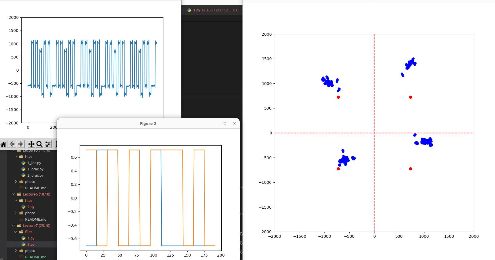

# Задание на практику 

# Задания Приём синусойды
**Задача 1**    
Передайте синусойду в рамках одного ADALM Pluto SDR. Выведите графики отправленного и принятого в итоге графика.

Делается это очень просто, обычно, проблемы тут возникают только с тем, как же нам сформировать синусойду. 
Важно понимать несколько базовых вещей:
1) Генерируемые вами значения должны быть комплексными, а значит, необходимо формировать две составляющие, реальную и мнимую. Например:

```python
i = np.cos(2 * np.pi * t * fc) * 2 ** 14
q = np.sin(2 * np.pi * t * fc) * 2 ** 14
```

2) Не забываем, что нужно задать частоту, и ось временных отсчетов на которой будут генерироваться наши значения синусойды (рекомендуется связать *fc* и *sample rate*)

2) Значения отправляем на наш передатчик, незабываем, что они должны быть комплексными. (`samples = i + 1j * q`)

**Задача 2**    
Попробуйте организовать полудуплексную передачу. Допустим, на вашей SDR будет реализован передатчик, а у соседа - приёмник. 

Для этого требуется правильно прописать код, чтобы он реализовывал только передатчик или только приемник.

**Примечание**. Пока, мы не реализуем программную синхронизацию. На текущем занятии синхронизация будет ручная, предупредите коллегу о начале передачи, запустите код приемника и передатчика синхронно
*Опциональная задача* Постройте спектр принятого сигнала, что в нем примечательного?

*Вопросы для исследования:*
1) Что особенного в принятом сигнале? Сдвинут ли он по фазе? Как изменяется амплитуда?

2) Вы можете регулировать чувствительность приемника и мощность передатчика. Постройте зависимости уровня принятого сигнала от мощности передатчика и чувствительности приемника (не менять положение SDR в пространстве!). Рекомендуется в отчет занести полученную табличку значений и графики зависимостей.

3) После запуска передачи, можно принимать какое-то время исходный сигнал. Как долго это происходит и от чего зависит?

4) Опытным путем установите эффективную дальность для нашей системы передачи.
5) * Передать сложный сигнал, с несколькими компонентами, корректно ли он передается?

# Задания Пример модуляции QPSK

**Задача 1**. Сгенерировать QPSK-модулированный сигнал при помощи одного ADALM PLuto в режиме полного дуплекса.

1) Выведите спектр полученного сигнала. Зафиксируйте график в отчет. Чем он отличается от полученного ранее для синусоиды?

2) Постройте график временной области, для сэмплов, отправляемых на передачу. Зафиксируйте.

3) Постройте график временной области принятого сигнала. Как он выглядит? 

**Задача 2***. Сгенерировать QPSK-модулированный сигнал и передать его на ближайший модуль ADALM PLuto SDR.

Провести сравнение полученных результатов и сделать выводы.

**Задача повышенной сложности.** Попробуйте передать закодированное сообщение при помощи QPSK модуляции.


# Выполнение

### №1_1


```python
t = np.linspace(0, 1, 1000)
fc = 10
i = np.cos(2 * np.pi * t * fc) * 2 ** 10
q = np.sin(2 * np.pi * t * fc) * 2 ** 10

samples = i + 1j * q
```

### №1_2
```python
sdr.tx_cyclic_buffer = True
sdr.tx(samples)
for r in range(30):
    rx = sdr.rx()
    plt.clf()
    plt.plot(rx.real)
    plt.ylim(-2000, 2000)
    plt.draw()
    plt.pause(0.05)
    time.sleep(0.0001)
```

Я выполнил отправку и получение на одном совём sdr  
     
синус выше принимаемого максимума ->
понизил чувствительность передатчика до `-23дБ`     


Получил спектр  

     
Частота 10Гц, как я и указывал `fc = 10`

### №1_questions

1) Что особенного в принятом сигнале? Сдвинут ли он по фазе? Как изменяется амплитуда?  
*Принятый сигнал ловиться в цикле передачи, значит от вмещён по фазе.*      *Амплитуда уменьшилась*

2) Вы можете регулировать чувствительность приемника и мощность передатчика. Постройте зависимости уровня принятого сигнала от мощности передатчика и чувствительности приемника (не менять положение SDR в пространстве!).     Рекомендуется в отчет занести полученную табличку значений и графики зависимостей.      
*Я лишь настроили чтобы синусойда не превышала лимит и была не слишком маленькой, поглащённой шумами*

3) После запуска передачи, можно принимать какое-то время исходный сигнал. Как долго это происходит и от чего зависит?  
*Сигнал передаётся пока не задьются бутер передачи*

4) Опытным путем установите эффективную дальность для нашей системы передачи.   
`sdr.tx_hardwaregain_chan0 = -23`


### №2_1
Спектр QPSK-модулированного сигнала     
  
        

График временного и полученного сигнала отправляемых `samples`    


scatter plot всех сигналов      
           
scatter plot одного символа     


### №2_2
Передал сигнал на другой Adalm Pluto SDR(сриншотов нет)

### Задача повышенной сложности
выполнена в коде        
