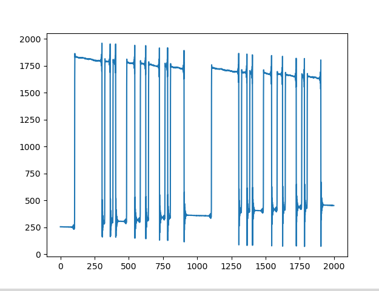
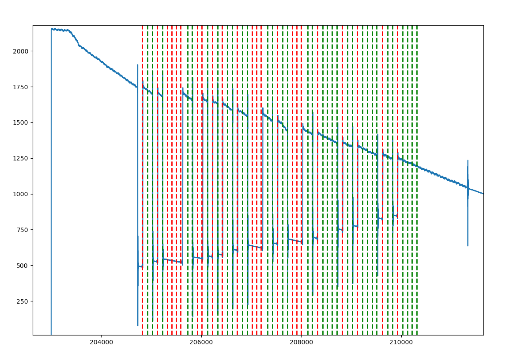

# Задание на практику 

# Задание
Нужно закодировать слово кодировкой *ASCII*     
Перевести битовую последовательность в “радиоволну” определенной формы при помощи техники модуляции     
Передать этот сигнал    
Получить этот сигнал    
Декодировать и вывести переданное слово 

# Выполнение
#### Сначала настроил sdr:   
`sdr = sdr_settings("ip:192.168.2.1", 2300e6+(2e6*2), 1000, 1e6,0,30)` 

#### Кодирование слова | добавление start и stop последовательности  
`bit_array = create_bit_str('rea', 10, 5)`  
```
Вывод без start и stop

len bit_array = 24
0 1 1 1 0 0 1 0
0 1 1 0 0 1 0 1
0 1 1 0 0 0 0 1
```
#### Создание samples    
`samples = samples_from_bits(bit_array, 20, 2**14, 2**1, 5) `   
(`5` в конце добавляет чуть больше сэмплов в конце)     
    

#### Передача samples циклически     
`rx = tx_sig(samples, True)`    

#### Приём Rx по 2000    
`rx = rx_cycles_buffer(2)`    
    

#### Получение нулей и единиц из сигнала     
`output = decoding_rx(rx, 1000, 190, 90, 19, -11)`    
    

#### Декодирование битовой последовательности    
`print('Декодированное слово -', decrypt_binary_to_ascii(output))`


### Примеры выводов:    
#### В реальнов времени: 
```
(закодированное слово "hsy")
24
Декодированное слово - hsy
0
Декодированное слово - 
24
Декодированное слово - hsy
24
Декодированное слово - hsy
0
Декодированное слово - 
21
Декодированное слово - Длина массива должна быть кратной 8
0
Декодированное слово - 
12
Декодированное слово - Длина массива должна быть кратной 8
```

#### Выключение при правильном декодировании:
```
len bit_array = 25
0 1 1 0 1 0 0 0 
0 1 1 1 0 0 1 1 
0 1 1 1 1 0 0 1 
0 
24
0 1 1 0 1 0 0 0 
0 1 1 1 0 0 1 1 
0 1 1 1 1 0 0 1
Декодированное слово - hsy

len bit_array = 25
0 1 1 1 0 0 1 0 
0 1 1 0 0 1 0 1 
0 1 1 0 0 0 0 1 
0 
24
0 1 1 1 0 0 1 0 
0 1 1 0 0 1 0 1 
0 1 1 0 0 0 0 1
Декодированное слово - rea
```
