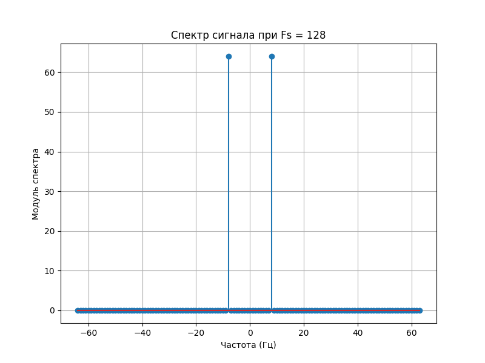

# Задания для стипендии 

<p style="text-align: center;">СОДЕРЖАНИЕ</p>


[Задания](#Задания)    
- [Задание 1](#Задание1)    
- [Задание 2](#Задание2)  

[Выполнение](#Выполнение)  
- [Задание 1](#Задание1_1)  
    - [Передатчик](#Передатчик)    
    - [Приёмник](#Приёмник)
- [Задание 2](#Задание2_1)
    - [Дискретизация сигналов. Вычисление ДПФ](#ffr)    
    - [Основы цифровой фильтрации](#filter)


## Задание №1
<a name="Задания"></a></a> 
<a name="Задание1"></a></a> 
#### Входные параметры:
*N* – число бит, четное значение (например, 50)     
*Fs* – частота дискретизации (например, 500 000 семплов в сек)      
*Ns* – число семплов на 1 модуляционный символ (например, 10/30/50/100 семплов на символ)   
Несущая частота – 900 МГц

**Передатчик:**
1.	Сформируйте случайную битовую последовательность из N бит (вх.параметр)
2.	Добавьте 20 бит с единицами, выполняющих роль синхронизирующей последовательности, а также опорных пилотных сигналов, по которым можно будет оценить изменение фазы полученного сигнала
3.	Сформируйте массив комплексных QPSK-символов. Длительность одного символа равна Ns отсчетов
4.	Зациклите буфер с символами на передачу и отправьте в радиоэфир
5.	Выведите на график временное и частотное представление сформированного сигнала  

**Приемник:**       
1.	Запишите входной сигнал в массив 
2.	Выведите на график временное и частотное представление сформированного сигнала. Проанализируйте влияние длительности передаваемого символа на ширину спектра, изменяя параметр Ns (уменьшить и увеличить, вывести график трех спектров: для Ns, Ns/2 и Ns*2)
3.	Определите время начала последовательности с учетом ваших знаний о синхронизирующей последовательности.
4.	Выведите на комплексной плоскости координаты полученных значений (перекрученные созвездия)
5.	Проанализируйте изменение фазы сигналов, используя символы синхронизирующей последовательности и компенсируйте данное изменение для информационных символов (разверните созвездия на верные позиции для последующей демодуляции)    
 
6.	Выполните демодуляцию полученных символов, сравните переданную и полученную битовые последовательности, определите количество ошибок.

## Задание №2
<a name="Задание2"></a></a> 

#### Дискретизация сигналов. Вычисление ДПФ  
Аналоговый сигнал `x(t)=Acos(ωt)` при дискретизации с интервалом времени T_s преобразуется в последовательность дискретных значений (чисел)  `x(n)=Acos(ωnT_s)=Acos(Ωn)`

1. Задайте  сигнал с частотой f, Гц, выберите частоту дискретизации  fs отсч/сек.  Получите набор отсчетов сигнала размером 64, 128, 256, изобразите выборку отсчетов командой plt.stem
2. Определите значение аналоговой частоты сигнала, которая соответствует нормированной частоте Ω=0.1π рад, Ω=0.3π при fs первого раздела   
3. При помощи функции fft модуля numpy вычислите ДПФ сигнала из раздела 1 для трех наборов отсчетов. Изобразите модуль спектра ДПФ с указанием частотной оси в Гц. 

#### Основы цифровой фильтрации
Сформируй	те сигнал, состоящий из суммы двух гармонических колебаний (косинусов) разных частот. Выберите частоту дискретизации для данного сигнала. Изобразите спектр ДПФ полученных отсчетов.      
Рассчитайте отсчеты цифрового фильтра ФНЧ с частотой среза для подавления сигнала с большей частотой. Импульсная характеристика ФНЧ вычисляется по  выражению `h(n)=  (sin⁡(Ω_cn))/πn`,  `Ω_c`  – нормированная частота среза.
Примените полученную импульсную характеристику фильтра к входному сигналу.  
Изобразите спектр ДПФ сигнала после фильтрации 


# Выполнение
<a name="Выполнение"></a></a> 

## Задание №1

<a name="Задание1_1"></a></a> 

### Передатчик
<a name="Передатчик"></a> 
#### 0
Сначала настройка SDR   
`sdr = sdr_settings("ip:192.168.3.1", 900e6, 1000, 1e6,0,15) # type: ignore` (использование моей функции)

#### 1
```py
N = 50
random_bits = [random.choice([0, 1]) for _ in range(N)] #создание рандомных битов 
```   
#### 2
```py 
random_bits = [1] * 20 + random_bits # добавление 20 единиц в начале
```
#### 3
```py
bit_pairs = [random_bits[i:i+2] for i in range(0, len(random_bits), 2)] # Разделите битовую последовательность на пары битов
decimal_numbers = [int(''.join(map(str, pair)), 2) for pair in bit_pairs] # Преобразуйте каждую пару битов в десятичное число
decimal_numbers = np.array(decimal_numbers)

#Генерируем QPSK-модулированный сигнал, 16 сэмплов на символ
x_degrees = 45 + (90 * decimal_numbers)
x_radians = (45 + (90 * decimal_numbers)) * np.pi / 180.0
x_symbols = np.cos(x_radians) + 1j*np.sin(x_radians) #генерируем комплексные числа
samples = np.repeat(x_symbols, Ns) # Ns сэмплов на символ
samples *= 2**14 #Повысим значения для наших сэмплов
```
#### 4
Зацикливание передачи samples
```py   
tx_sig(samples, True) # Моя функция
```
#### 5
*Временной график*      
   

*Частотные графики*     
    
  
  

### Приёмник
<a name="Приёмник"></a> 

#### 1
Записывает в массив по 3*1000 отсчётов
```py
rx = rx_cycles_buffer(3)
```
#### 2
*Временной график*      
   
*Частотные графики*     
    
  
  

#### 3
Выводит конец начальной последовательности  
(начало последовательности *i-490*)
```py
threshold = 50
for i in range(len(rx)):
    if abs(rx[i] - rx[i-1]) < threshold:
        k += 1
    else:
        k=0
    if k == 490:
        print(i, rx[i])
```
#### 4
Перекрученное созвездие     
  

#### 5
Задание предполагало компенсировать "перекручивание", но из-за нехватки времени я успел только найти угол на котором нахотятся символы начальной последовательности
```py
current_angle = cmath.phase(rx[i]) # эта строчка стоит в конце предыдущего цикла
```


## Задание №2
<a name="Задание2_1"></a> 

### Дискретизация сигналов. Вычисление ДПФ  
<a name="fft"></a> 

### 1
Сигнал  
`t = np.arange(0, 1, 1/fs)`  
`x = a * np.cos(2*np.pi * f * t )`   
 
 
    

### 2
Аналоговая частота сигнала, которая соответствует нормированной частоте     
*Ω=0.1π* рад, **12.8**    
*Ω=0.3π* при fs первого раздела:  
(fs = 64) **9.6**     
(fs = 128) **19.2**   
(fs = 256) **38.4**   

### 3   
**Модуль спектра ДПФ с указанием частотной оси в Гц**     
        
       
   


### Основы цифровой фильтрации
<a name="filter"></a> 

Сигнал суммы косинусов с частотами 8Гц и 16Гц     
       

Входной сигнал и после фильтрации   
  

Спектры(приближенные)
  