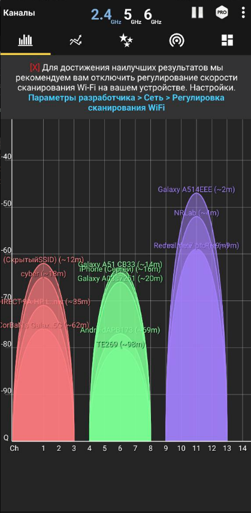
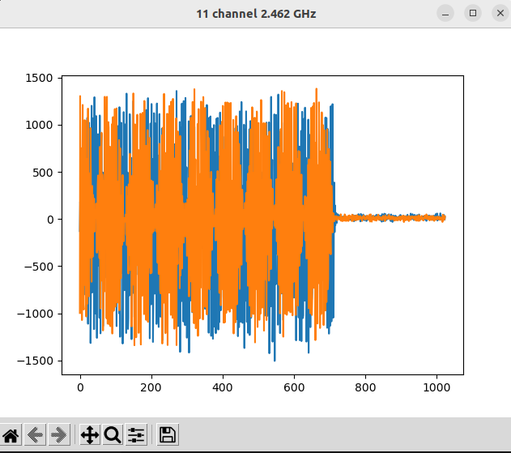
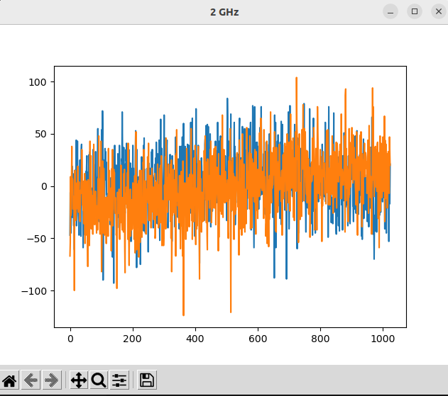

# Задание на практику 

1. При помощи приложения на Android\iOS - **WifiAnalyzer** [5] найти работающие точки доступа на несущей частоте **2.4** [GHz];
2. Определить канал наиболее мощной из них. При помощи **Google** найти несущую частоту в данном канале;
3. Принять радиосигнал на несущей частоте выбранной точки доступа **WiFi**; Показать на графике.  
    a. Графики подписать по имеющейся на данный момент информации. 
4. При подозрительной активности радиоканала зафиксировать “снимок” экрана с явными признаками передатчика. Проще говоря, визуально отличить шумы от передачи данных;
5. Сделать скриншот;
6. Добавить код программы и результаты (скриншот) на **GitHub**; 
    - a. В Readme добавить описание работы по шага. Что было сделано:
        - i. Как нашли несущую точки доступа;
        - ii. Имя точки доступа;
        - iii. Скриншот с Wifi Analyzer;
        - iv. Скриншот вашей программы.
        
 
# Выполнение
  
С помощью приложения **WifiAnalyzer** определил что больше всего загружен 11 канал на чистоте 2.4GHz  
Сеть которая имела максимальный сигнал в этом канале *Galaxy A514EEE*  
Я нашёл в интернете что 11 канал на частоте 2.4GHz имеет частоту *2.462GHz*  
Поэтому я установил  
```sh
sdr.rx_lo = 2462000000
```

Получилось поймать сигнал:  

 

Сигнал обычного шума на 2GHz:  

 
